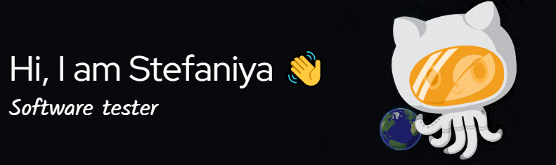

<!--

-->

### Software quality enthusiast 🚀 |  Continuous learner 📖 | Innovation seeker 🔍 | Curious mind 🧩

<h3>Hello! I'm Stef, a passionate manual and automation test engineer, committed to improving software quality and user experiences, always driven by the belief that excellence is a journey, not a destination!</h3>

<!--

-->

### 🛠️ Tools and Technologies

 
### 🏆 GitHub Stats

 <!--

-->

 

  

  

### 📩 Let's connect:

  
  
  
   
  
  

